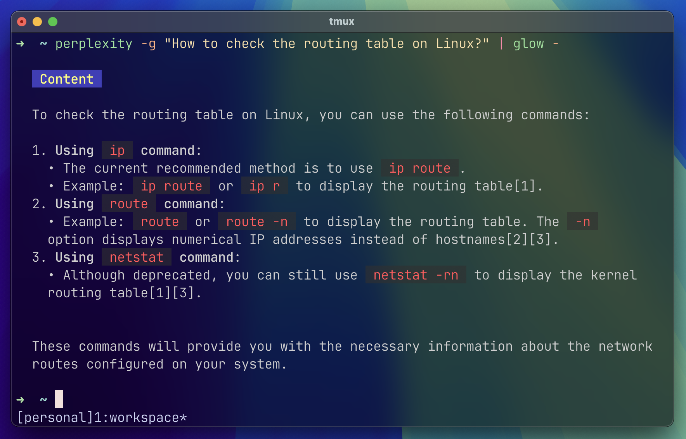

## Perplexity CLI 🔎

Perplexity CLI is a simple and convenient command-line client for the Perplexity API, allowing users to quickly ask questions and receive answers directly from the terminal.

## Features
-   Easy querying of the Perplexity API
-   Support for various language models
-   Optional display of token usage statistics
-   Optional display of citations
-   Colorful output formatting (with glow support)
-   API key handling from environment variable or command-line argument

## Requirements
-   Python 3.6+
-   `requests` library

## Installation
No installation is required. You can run the script directly from the GitHub repository or install it locally.Example of local installation:

```bash
curl -s https://raw.githubusercontent.com/dawid-szewc/perplexity-cli/main/perplexity.py > ~/.local/bin/perplexity \
chmod +x ~/.local/bin/perplexity \
echo 'export PATH="$HOME/.local/bin:$PATH"' >> ~/.bashrc \
echo 'export PERPLEXITY_API_KEY="your-api-key"' >> ~/.bashrc
```
## Usage
```bash
perplexity "What is the meaning of life?"
```

## With Additional Options
```bash
perplexity -uc -m llama-3.1-sonar-large-128k-online "Explain Einstein's theory of relativity"
```

## Options
-   `-v`, `--verbose`: Enable debug mode
-   `-u`, `--usage`: Show token usage statistics
-   `-c`, `--citations`: Show citations
-   `-g`, `--glow`: Use Glow-compatible formatting
-   `-a API_KEY`, `--api-key API_KEY`: Set the API key (optional, defaults to `PERPLEXITY_API_KEY` environment variable)
-   `-m MODEL`, `--model MODEL`: Choose the language model (default: llama-3.1-sonar-small-128k-online)

## Available Models
-   llama-3.1-sonar-small-128k-online
-   llama-3.1-sonar-large-128k-online
-   llama-3.1-sonar-huge-128k-online

## Configuration
Set the `PERPLEXITY_API_KEY` environment variable with your Perplexity API key:
```bash
export PERPLEXITY_API_KEY="your-api-key"
``` 

## License
This project is released under the MIT License.

## Author
Dawid Szewc

## Contributing
We welcome issue reports and suggestions for improvements through GitHub Issues.It's worth noting that the project is actively developed and may contain additional features or changes not included in this description. It's recommended to check the latest documentation in the GitHub repository for the most up-to-date information.
